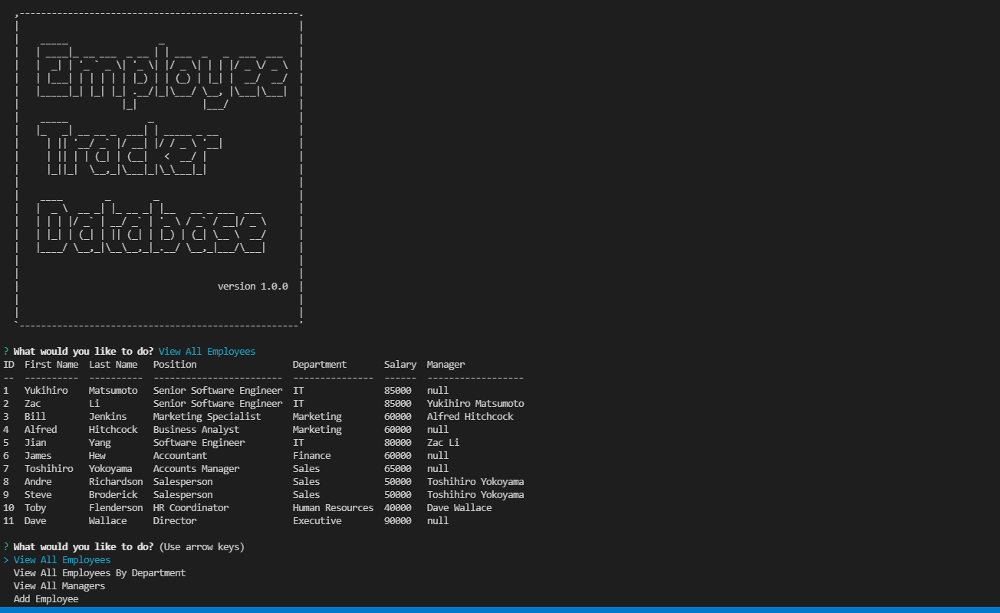

# Employee Tracker Database

Link to the deployed project repository can be viewed here: [Employee Tracker Database](https://github.com/leonhsu95/employee-tracker-database)

## Description

This project aims to create an instant template for README.md for developers in an easy manner

## Table of Contents
- [Installation](#installation)
- [Usage](#usage)
- [Credits](#credits)
- [License](#license)


## Installation

To install the files into your local repo, using Git Bash Terminal:

1) Create a folder locally to nominate for cloning from online repo
2) Clone with SSH by

```GitBash Commands
git clone git@github.com:leonhsu95/employee-tracker-database.git"
 ```

Additionally, please install node.js and install the inquirer package in your terminal with

```Terminal Commands
npm i init -y
npm i
npm i inquirer
npm i mysql
npm i dotenv
npm i console.table
npm i asciiart-logo
npm i nodemon
 ```

 Before you run the code, please change scripts:{start: } to node index.js in the package.json and change your database login credentials.

## Usage

The project should look like this:


A Video Demonstration can be viewed here: [Demo](https://drive.google.com/file/d/1FhNyQMFCyWMhxsPi5u6TB_szbQVm-xK7/view?usp=sharing)

Usage of this project is subject to the below license.

## License

Copyright 2021 © Leon Hsu [leonhsu95](https://github.com/leonhsu95). All rights reserved.
Licensed under the [MIT](https://opensource.org/licenses/MIT).

Permission is hereby granted, free of charge, to any person obtaining a copy
of this software and associated documentation files (the "Software"), to deal
in the Software without restriction, including without limitation the rights
to use, copy, modify, merge, publish, distribute, sublicense, and/or sell
copies of the Software, and to permit persons to whom the Software is
furnished to do so, subject to the following conditions:

The above copyright notice and this permission notice shall be included in all
copies or substantial portions of the Software.

THE SOFTWARE IS PROVIDED "AS IS", WITHOUT WARRANTY OF ANY KIND, EXPRESS OR
IMPLIED, INCLUDING BUT NOT LIMITED TO THE WARRANTIES OF MERCHANTABILITY,
FITNESS FOR A PARTICULAR PURPOSE AND NONINFRINGEMENT. IN NO EVENT SHALL THE
AUTHORS OR COPYRIGHT HOLDERS BE LIABLE FOR ANY CLAIM, DAMAGES OR OTHER
LIABILITY, WHETHER IN AN ACTION OF CONTRACT, TORT OR OTHERWISE, ARISING FROM,
OUT OF OR IN CONNECTION WITH THE SOFTWARE OR THE USE OR OTHER DEALINGS IN THE
SOFTWARE.

## Features

- User will be given options to navigate the app.
- Console Table will display and generate all information within MySQL Database
- User can add / edit /remove employees, assigned managers, roles and departments

- Improvements: I can add a null value to clear manager assigned to employee in the future. This can be solved be mapping array and then extended ... in new array


## Tests

This project can be tested with [JS Validation Service](https://jshint.com/).
The Inquirer Package can tested further, please refer to documentation at [npm Inquirer](https://www.npmjs.com/package/inquirer) and [npm nodemon](https://www.npmjs.com/package/nodemon).


